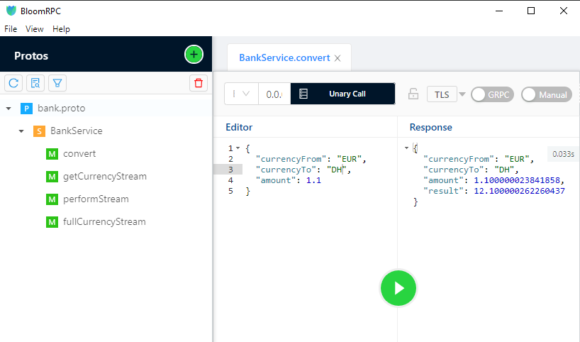
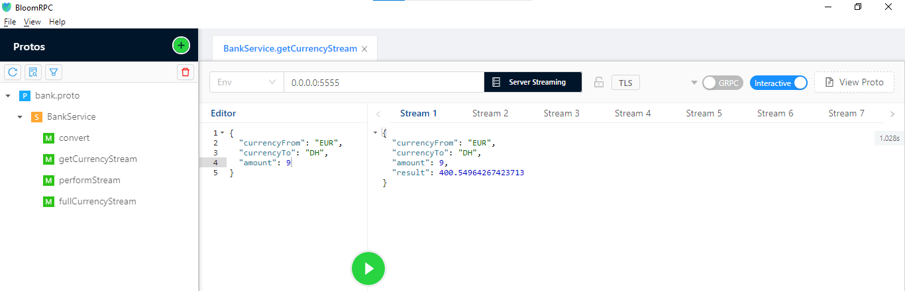
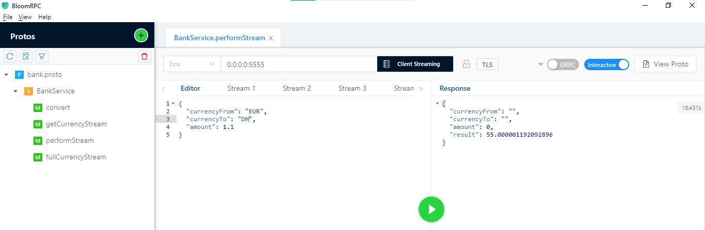
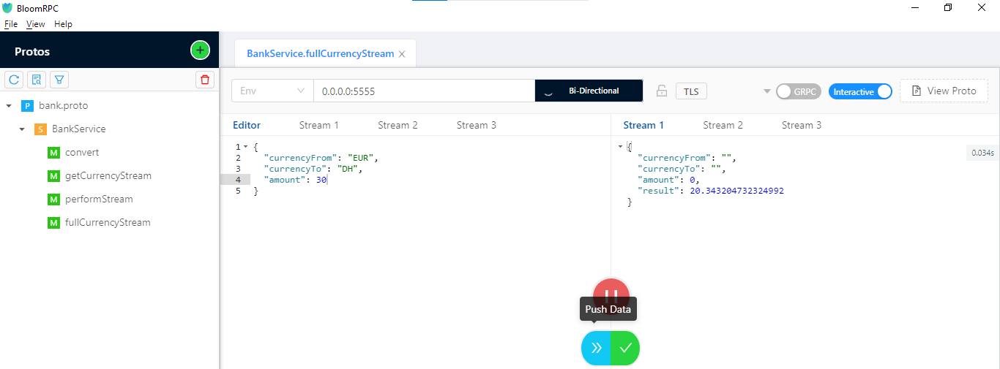

<h3>Tester le serveur avec un client GRPC "BloomRPC"</h3>
  <h4>Unary Model</h4>

Le premier modèle, Unary, implique une simple requête-réponse entre le client et le serveur pour convertir une valeur de devise unique.

  
  <h4>Server Sreaming Model</h4>

Le deuxième modèle, Server Streaming, permet au serveur de renvoyer un flux continu de résultats de conversion à mesure que la valeur de la devise change.

  
  <h4>Client Streaming Model</h4>

Le troisième modèle, Client Streaming, permet au client d'envoyer un flux continu de valeurs de devise à convertir et le serveur renvoie une seule réponse.

  
  <h4>BiDirectional Streaming Model</h4>

Le quatrième modèle, BiDirectional Streaming, permet une communication bidirectionnelle entre le client et le serveur, où le client envoie un flux continu de valeurs de devise à convertir et le serveur renvoie un flux continu de résultats de conversion.

  
